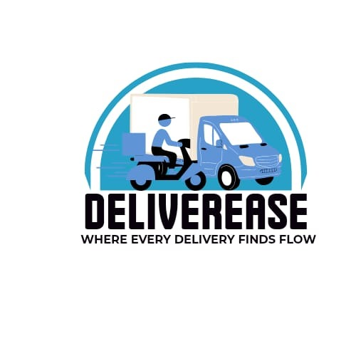

# Deliverease Delivery Management Dashboard



**Deliverease** is a modern, responsive delivery management dashboard designed for logistics companies, courier services, and delivery teams. It provides a comprehensive suite of tools for managing drivers, tracking deliveries, handling customer requests, monitoring finances, and more—all in a visually appealing and user-friendly interface.

---

## 🚀 Core Features

- **Dashboard Overview**: Get a quick summary of registered drivers, total deliveries, and recent activity.
- **Registered Drivers**: Add, edit, and manage a list of drivers. Only 3 shown by default, with a "See More" toggle. 
- **Deliveries**: View all deliveries in a card-based UI, with search and filter options.
- **Tracking**: Track parcels with a modern, card-based interface, search, and filters. 
- **Request Management**: Submit new delivery requests and view their status.
- **Promotions**: Highlight discounts and special offers, including a 20% student discount.
- **Finance**: Visualize revenue and profit trends, see recent transactions, and view staff payments. 
- **Chatbot**: Get instant answers to tracking questions with a built-in chatbot.
- **Help & Support**: Clear instructions for dealing with parcel trafficking and a dedicated help page.
- **Location**: View driver locations on a map-style background and select drivers for details.
- **Profile**: Edit admin information, including avatar and contact details.
- **Fully Responsive**: Optimized for desktop, tablet, and mobile devices.

---

## 🖼️ Visual Impressions

<p align="center">
  
  
  
  
</p>

---

## 🛠️ Getting Started

1. **Clone the repository:**
   ```bash
   git clone https://github.com/yourusername/deliverease.git
   cd delivereasee5app
   ```
2. **Install dependencies:**
   ```bash
   npm install
   ```
3. **Run the app:**
   ```bash
   npm start
   ```
   The app will open at [http://localhost:3000](http://localhost:3000)

---

## 📸 Screenshots

- **Login Page:**
  
- **Dashboard Overview:**
  
- **Tracking Section:**
  
- **Driver Avatar Example:**
  

---

## 📧 Admin Access
- **Email:** admin@deliverease.com
- **Password:** admin123

---

## License
MIT
